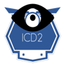

# icd2 - HLS Central West ICD10 Bot

 

This bot is a simple demo that allows clinicians to query for ICD10 codes.

### Dialogs

This generator provides the following dialog modules:
- Greetings.js
- SearchCodes.js

Each dialog module exports a class with three properties to help simplify addition to an existing bot:
- **id:** Used for the id
- **waterfall:** The logic (or waterfall) for the dialog
- **name:** The intent name for the dialog for triggering
- **pattern:** A regular expression used for determining user intent.

## Getting Started

### Dependencies

- **[Node JS](http://nodejs.org)** v6.14.3 or higher.
- **[ICD2 Functions](https://github.com/TylerDurham/icd2_functions)** Azure web functions to search for ICD10 codes.
- **[Restify](http://restify.com)** Used to host the web service for the bot, and for making REST calls
- **[dotenv](https://github.com/motdotla/dotenv)** Used to manage environmental variables

### Configuring the bot

Update `.env` with the appropriate keys OR specifiy in your Azure App settings:

* PORT=3978
* LOG_PREFIX=[icd2-bot]
* URL_FUNC_SEARCH_CODES=https://your_url_to_functions_here
* MICROSOFT_APP_ID=your_bot_app_id_here
* MICROSOFT_APP_PASSWORD=your_password_here

## Sample Queries

To invoke the help dialog, enter the following into the bot:

```
help 
```


You can query for codes using the command ```search codes```, then specifying keywords:

```
search codes edema orbit

search codes obstruction newborn
```

You can also search for phrases by closing in quotes:

```
search codes "central nervous system"
```

You can also combine keywords and phrases:

```
search codes "central nervous system" neoplasm
```

## Additional Resources

- [Microsoft Bot Framework](https://dev.botframework.com).
- [Microsoft Virtual Academy Bots Course](http://aka.ms/botcourse)
- [Bot Framework Documentation](https://docs.botframework.com)
- [LUIS](https://luis.ai)
- [QnA Maker](https://qnamaker.ai)